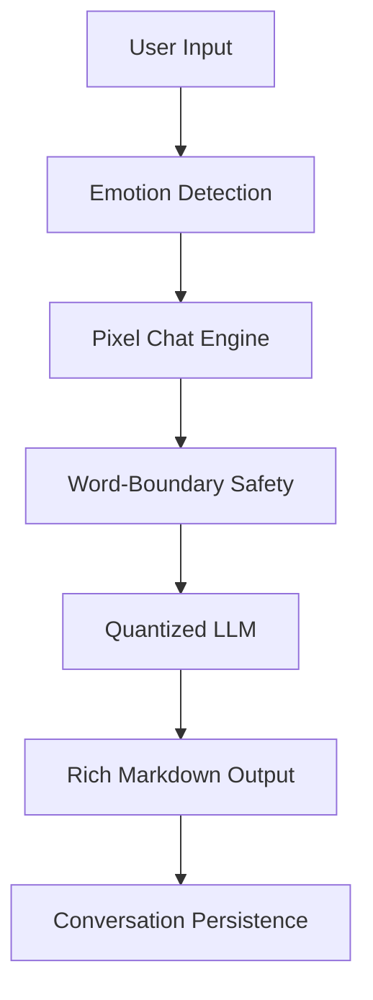

# 🧠 Pixel: Emotion-Recognition AI for Raspberry Pi
## Professional AI Companion for the AI Mirror Project


> [!NOTE]
> **Project Goal**: A complete, production-ready pipeline for building, training, and deploying an emotion-aware, offline LLM named **Pixel**. Optimized for Raspberry Pi 5 and designed for students/children aged 8-16 with advanced safety features and ethical memory management.

---

## 🎯 Project Overview

### Purpose
Create an AI companion for an **Emotion Recognition AI Mirror** that:
- ✅ **Recognizes Emotions**: Adapts tone based on detected facial expressions.
- ✅ **Professional Identity**: Acts as **Pixel**, a helpful and calm AI (similar to Claude).
- ✅ **Offline Privacy**: Operates 100% locally on Raspberry Pi.
- ✅ **Structured Knowledge**: Responds with beautiful **Markdown** (Headings, Passages).
- ✅ **Ethical Memory**: Remembers context across conversations while respecting privacy.

### Key Features
| Feature | Description |
|---------|-------------|
| **🎭 Emotion-Aware** | Adapts responses based on detected emotions (happy, sad, angry, etc.) |
| **🤖 Pixel Persona** | Professional, friendly, and structured "Claude-like" personality |
| **🛡️ Safety-First** | Word-boundary filtering prevents false positives (e.g., "skills" vs "kill") |
| **📖 Markdown UI** | Rich terminal output with H1, H2, and passage formatting |
| **🧠 Memory System** | Context-aware chat with a 2048-token window |
| **⚡ Optimized** | Runs lightning-fast on Raspberry Pi 5 (GGUF 2-bit/4-bit) |

---

## 📂 Repository Structure

```
llmemo/
├── 📁 src/                        # Core application logic
│   ├── run_ai_mirror.py          # Main entry point (Chat UI)
│   ├── emotion_prompt_template.py # Pixel's brain & prompts
│   ├── memory_manager.py         # Context & Persistence
│   └── safety_filter.py          # Smart content moderation
├── 📁 docs/                       # Guides & Documentation
├── 📁 scripts/                    # Utility scripts (Train, Quantize)
├── 📁 data/                       # User memory & storage
└── requirements_training.txt      # Dependencies
```

---

## 🚀 Quick Start

**Pixel AI** is optimized for both desktop testing and low-power hardware like the Raspberry Pi.

### 🍎 1. Installation (Raspberry Pi / Linux / Mac)
Open your terminal and run:

```bash
# Install the official package
pip install pixel-ai

# Download the model weights (~350MB)
pixel-ai install

# Start learning!
pixel-ai run
```

---

### 🪟 2. Installation (Windows)
Open PowerShell or Command Prompt and run:

```powershell
# 1. Install the package
pip install pixel-ai

# 2. Download the model weights
python -m pixel_ai.cli install

# 3. Start chatting!
python -m pixel_ai.cli run
```

> [!TIP]
> **Windows Note:** If `pixel-ai` as a command doesn't work, it's because your Scripts folder isn't in your Windows PATH. Using `python -m pixel_ai.cli` always works as long as `python` works!

---

## 🏗️ System Architecture



---

## 📄 License & Author
This project is licensed under the MIT License - see the [LICENSE](LICENSE) file for details.

**About the Author**
Created by **Shubham Kambli**. Passionate about AI, Embedded Systems, and Edge Computing.
[GitHub Profile](https://github.com/NotShubham1112)
*   [**Ethical Guidelines**](docs/ethical_guidelines.md): Safety and privacy standards.
*   [**RAG Architecture**](docs/RAG_ARCHITECTURE.md): How the knowledge base works.

---


This project prioritizes **Safety by Design**:
1.  **Filter**: Blocks inappropriate content *before* it reaches the LLM.
2.  **Validate**: Checks the LLM's output before showing it to the user.
3.  **Privacy**: No data leaves the device.

---

## 🤝 Contributing
Contributions are welcome! Please open an issue or pull request.

## 📄 License
This project is open-source under the [MIT License](LICENSE). Copyright &copy; 2026 Shubham Kambli.

---

## 👨‍💻 About the Creator

**Shubham Kambli** (He/Him)  
*Founder @x_conquestx | Building AI, Quant & Open-Source Products*

Turning Research into Real Systems.  
CSE @ B.Tech | Mumbai, Maharashtra, India 🇮🇳

> "I build systems that bridge the gap between theoretical AI and practical, edge-deployed reality."

[**Contact / Follow**](#) &bull; [**GitHub**](https://github.com/NotShubham1112)

